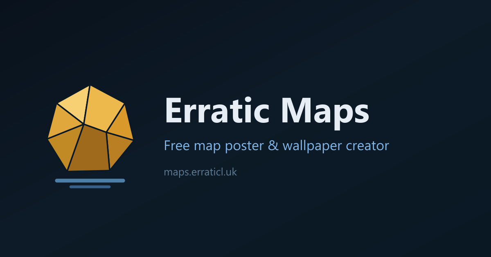

# Erratic Maps

Erratic Maps is a free, browser-based map poster and wallpaper creator,
deployed at [maps.erraticl.uk](https://maps.erraticl.uk).

It is a fork of [Terraink](https://github.com/yousifamanuel/terraink) by
Yousuf Amanuel, rebranded and extended. An "erratic" is a boulder that a
glacier carried far from its origin — this project is that boulder.

## What Erratic Maps adds

- The **plate**: three controls that change how the map draws, not
  what it shows. A line weight from 0.5x to 2x, solid or outline
  fills for water, parks, landcover and buildings, and a switch for
  the road casings. The named plates *Full*, *Line* and *Bold* set
  all three at once. They live in the Layers section under
  "Drawing".
- A **building height triad**: a theme can color buildings in three
  tones by rendered height (low, mid, tall) instead of one blended
  color.
- **Ten triad themes**: Classic and Candy (ported from the retired
  hand-built predecessor app), Catppuccin Mocha, Nord, Dracula,
  Gruvbox and Tokyo Night (after the MIT-licensed editor palettes of
  the same names), and the originals Iris, Glacier and Bauhaus.
- **Permalinks**: the URL hash always encodes location, distance,
  theme, layout, the poster names, the plate values and the layers
  that are off, so the address bar is a shareable link that restores
  the poster and skips the startup dialog. A key appears only when
  its value differs from the default.
- A **poster credits switch**: the Style section can remove the
  credit lines from the poster. The site keeps its attribution in the
  footer. If you publish a poster without the credit line, add
  "© OpenStreetMap contributors" next to it.
- A **gold-on-slate interface** with flat panels. Every color is a
  token in `src/styles/base.css`.


The poster above is Hanover in the Classic theme: yellow buildings are
low, orange buildings are mid-rise, red buildings are tall.

## Features (from upstream)

- **Custom city map posters** for any location in the world, powered by real OpenStreetMap data
- **Smart geocoding** — search for any city or region by name, or enter coordinates manually
- **Rich theme system** — choose from dozens of curated themes or build your own custom color palette
- **Detailed map layers** — roads, water bodies, parks, and building footprints with per-layer styling
- **Typography controls** — set city/country display labels in one of nine bundled, self-hosted typefaces
- **High-resolution export** — download a print-ready poster as PNG, PDF, or layered SVG at any defined dimension

## Run

```bash
npm install
npx vite
```

Upstream uses Bun (`bun install`, `bun run dev`); both work — this is a
plain Vite app.

## Build

```bash
npx vite build
```

## Environment

Check [`.env.example`](./.env.example) for available variables. All are
optional. `VITE_APP_CREDIT_URL` sets the on-poster credit line.

## License

This project stays under [AGPL-3.0](LICENSE), as required by the
upstream license. Upstream code released before April 3rd 2026 remains
under the [MIT License](LICENSE-OLD). If you deploy or modify this
code, you are responsible for complying with AGPL-3.0, including
preserving license and copyright notices.

## Trademark

Terraink™ is a trademark of Yousuf Amanuel. This fork does not use the
Terraink name or logo as its brand. The in-app footer carries the
credit "Based on Terraink source code". See
[TRADEMARK.md](./TRADEMARK.md) for the upstream trademark policy.

The Erratic Maps name and the pin-and-boulder mark are not affiliated
with Terraink.

## Attribution

- **Upstream source**: [Terraink](https://github.com/yousifamanuel/terraink) © Yousuf Amanuel, AGPL-3.0
- **Map data**: © [OpenStreetMap contributors](https://www.openstreetmap.org/copyright), licensed under [ODbL](https://opendatacommons.org/licenses/odbl/)
- **Tile schema**: © [OpenMapTiles](https://openmaptiles.org/), licensed under [ODbL](https://openmaptiles.org/docs/tileset/openmaptiles/)
- **Tile hosting**: [OpenFreeMap](https://openfreemap.org/)
- **Geocoding**: [Nominatim](https://nominatim.openstreetmap.org/) / OpenStreetMap data
- **Map renderer**: [MapLibre GL JS](https://maplibre.org/), licensed under [BSD-3-Clause](https://github.com/maplibre/maplibre-gl-js/blob/main/LICENSE.txt)

## Contributing

This fork tracks upstream through deliberate merges. Feature ideas that
are not Erratic-specific belong upstream — read the upstream
[CONTRIBUTING.md](./CONTRIBUTING.md) and contribute there.
